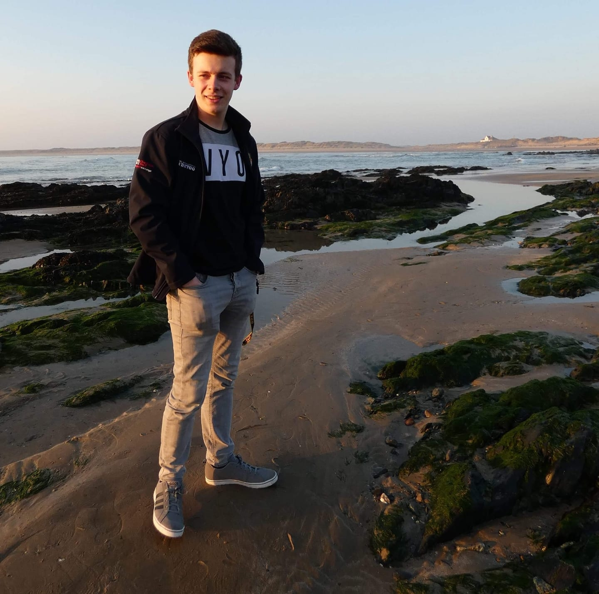

  Hey there! This page is created and maintained by myself, Daniel Ashton. I created this page as a way of displaying the projects I undertake and arranging them into a portfolio that I can proudly show to others.

  I am a 21-year-old student currently studying an Electronic Engineering course, accredited by the Institution of Engineering and Technology (IET), at Bangor University. I will graduate with a masters specialised in Programmable Logic Controllers and Advanced Control Systems.

  I enjoy solving problems in creative ways, where this has certainly assisted in my degree. Also, I have a curiosity for the inner workings of different items and processes to help give a broader understanding. I like to maintain productivity through the organisation of my goals and tasks.

